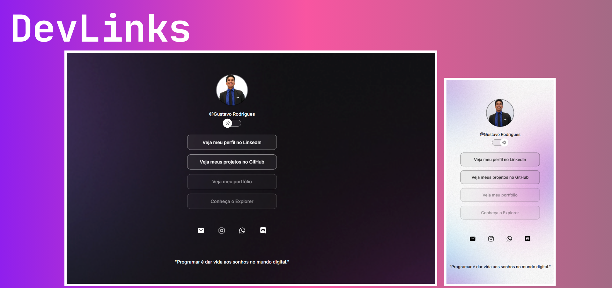

<h1 align="center"> Dev Links </h1>

Este projeto foi criado com foco em praticar e aplicar conceitos de HTML, CSS e JavaScript, seguindo a abordagem didática da Rocketseat.

  <a href="#-tecnologias">Tecnologias</a>&nbsp;&nbsp;&nbsp;|&nbsp;&nbsp;&nbsp;
  <a href="#-projeto">Projeto</a>&nbsp;&nbsp;&nbsp;|&nbsp;&nbsp;&nbsp;
  <a href="#-layout">Layout</a>&nbsp;&nbsp;&nbsp;|&nbsp;&nbsp;&nbsp;
  <a href="#memo-licença">Licença</a>

  

 

  

## 🚀 Tecnologias

Esse projeto foi desenvolvido com as seguintes tecnologias:

- HTML e CSS
- JavaScript
- Git e Github
- Figma

## 💻 Projeto

O DevLinks é um projeto desenvolvido com o objetivo de criar um cartão de visita online, onde qualquer pessoa pode reunir e compartilhar, de forma prática e visual, seus principais links como: portfólio, redes sociais, GitHub, LinkedIn, entre outros.
